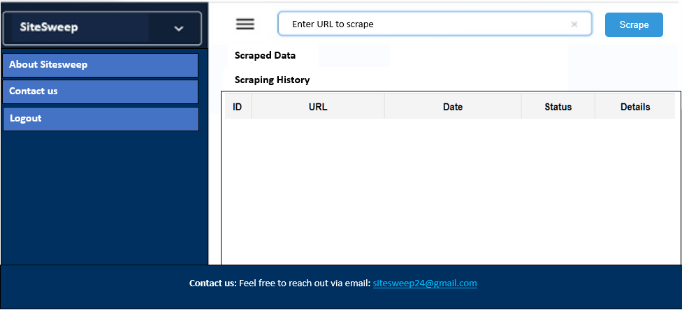

# SiteSweep : Scraper

**SiteSweep Scraper** is a web scraping application designed to help users collect, store, and manage data from websites effortlessly. Users can input URLs, scrape specific data (metadata, emails, phone numbers, etc.), view scraping history, and export results in CSV format. This project was built as a minimum viable product (MVP) for web researchers, analysts, and individuals seeking to automate data extraction processes.

> 🔗 **[Deployed Site](http://54.197.27.210:5000/)**  
> 📄 **[Final Project Blog Post](https://www.linkedin.com/pulse/introducing-sitesweep-scraper-my-latest-web-scraping-project-saina-w9guf/)**  
> 🔗 **[Jonathan Saina’s LinkedIn](https://www.linkedin.com/in/sainawj/)**  
> 🔗 **[Georges Mbock’s LinkedIn](https://www.linkedin.com/in/georges-mbock/)**

## Features
- User login
- Web scraping
- Access to scraping history
- CRUD funtions on the scraping history
- Export to CSV

## Setup

### Prerequisites
- Python 3.x
- Flask
- MySQL or SQLite (for testing)

### Frontend
The frontend consists of static HTML, CSS, and JavaScript.

### Backend
The backend is a Flask application with API routes for scraping and fetching history.

### Running the Application

1. Clone the repository:

   ```bash
   git clone https://github.com/sainawj/sitesweep_scraper
More infor on: https://sainawj.github.io/sitesweep/



---

## 🛠 Installation

To get started with SiteSweep Scraper on your local machine:

1. **Clone the repository:**
   ```bash
   git clone https://github.com/your-username/sitesweep-scraper.git
2. **Navigate to the project folder:**
   cd sitesweep-scraper

3. **Set up a virtual environment**
   ```bash
   python3 -m venv venv
   source venv/bin/activate   # For Linux/Mac
   venv\Scripts\activate      # For Windows
5. **Install dependencies:**
   ```bash
   pip install -r requirements.txt
6. **Set up MySQL database**
   ```bash
   mysql -u root -p
   CREATE DATABASE scraping_db;
   **Add required tables**
   mysql -u root -p scraping_db < /home/user/database/schema.sql

7. **Run the App!!**
     ```bash
   source venv/bin/activate
   export FLASK_APP=app.py
   export FLASK_ENV=development
   FLASK_APP=backend/app flask run --host=0.0.0.0
